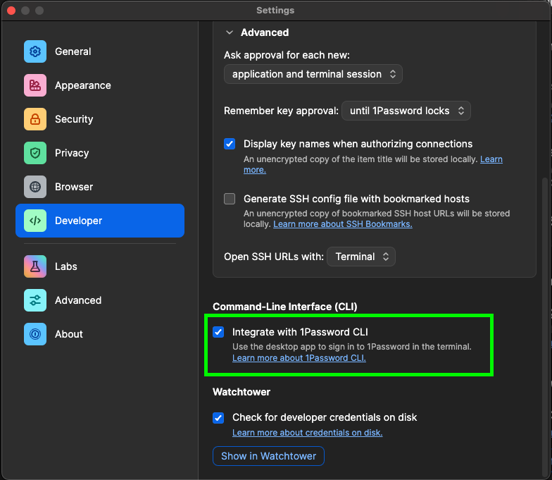
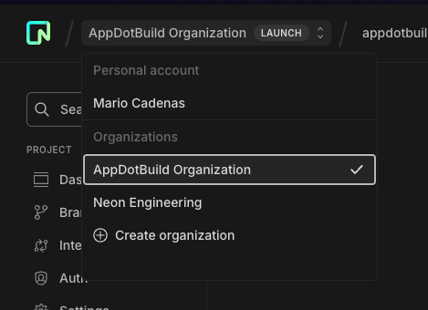
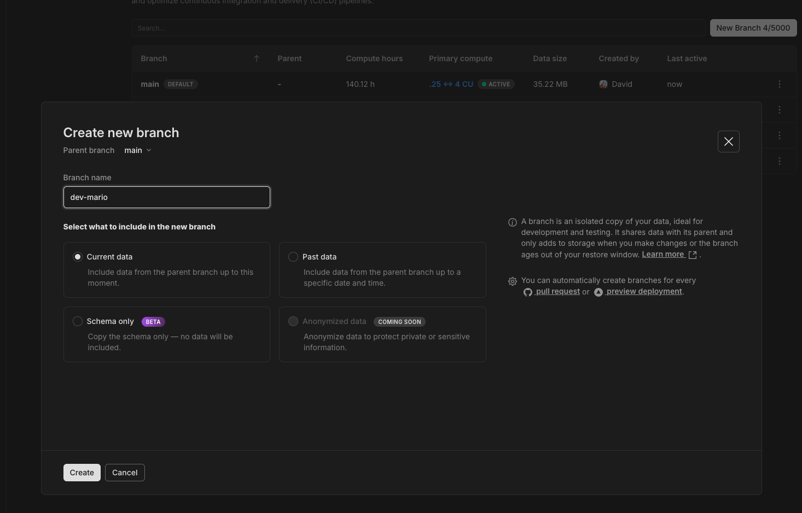

# Requirements

This project needs some dependencies in order to run, make sure to have them all installed.

### npm

Make sure to have node installed using [nvm](https://github.com/nvm-sh/nvm)

### pnpm

Run the following command

```bash
npm install --global corepack@latest
corepack enable pnpm
```

### bun

If you are using homebrew, you can directly run

```bash
brew install oven-sh/bun/bun
```

if not, you can find the instructions for your case [here](https://bun.sh/docs/installation#macos-and-linux).

### flyctl

Run

```bash
brew install flyctl
```

or

```bash
curl -L https://fly.io/install.sh | sh
```

Docs [here](https://fly.io/docs/flyctl/install/)

## 1Password CLI

Run

```bash
brew install 1password-cli
```

Docs [here](https://developer.1password.com/docs/cli/get-started)

## Setting up 1Password

Make sure you also have the app installed. Open the 1Password app, and go to settings.

Activate the "Integrate with 1Password CLI



## Setting up the project

First of all, go to [Neon console](https://console.neon.tech/app/projects/damp-surf-76179452/branches/br-proud-wave-a84j8pq6?branchId=br-proud-wave-a84j8pq6&database=neondb) into the AppDotBuild Organization



If you don't have access, please ask a member of the team to invite you, and wait until you have access to continue this instructions.

Now go into branches, and create a branch with the following structure `dev-<yourname>`



Now go into your branch, and click on `Connect`, copy your connection string, and execute the following command

```bash
op item create --category "API Credential" --vault "App.build" --title "DATABASE_URL_$(echo "$USER" | tr '[:lower:]' '[:upper:]')" 'credential=<connection-string>' 'expires=2099-12-31'
```

Now you can run the following command to setup your environment

```bash
bun setup
```

## Starting the project

Now you will need to run 2 different terminals, one with all the necessary servers, and the other one with the CLI.

In the first terminal run

```bash
bun dev
```

In the second terminal, you can choose to run the CLI in two ways:

- Compiled version: This has a process in the background that is recompiling it everytime you make a change. But you will need to run the command again after doing changes.

```bash
bun cli
```

- Watched version: This allows you to directly see the changes you are applying (is not HMR for now).

```bash
bun cli:watch
```
