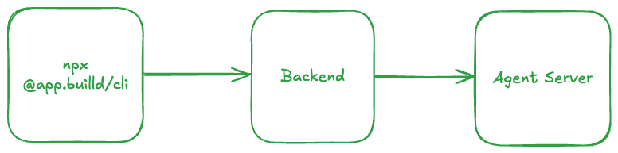

# app.build (platform)

[**app.build**](https://app.build) is an open-source AI agent for generating full-stack applications.

This is the "platform" repository for [app.build](https://app.build). Here, we have:

- The CLI. This is something that anyone can run with `npx @app.build/cli`.
- The backend. This is the control plane, or the "platform", for the applications generated by any of our interfaces. It is responsible for managing communications between the CLI and the agent, and for deploying the applications to a live URL.

The agent's source code is available in the [agent repository](https://github.com/appdotbuild/agent).

## Contributing

If you're looking to contribute to the CLI, or to the control plane, please refer to our [CONTRIBUTING.md](./CONTRIBUTING.md) document.

## Running locally

We will have proper instructions for running the CLI and the backend locally available soon. In the meantime, please feel free to refer to the [CONTRIBUTING.md](./CONTRIBUTING.md) document, as that should suffice if you're a bit patient.
